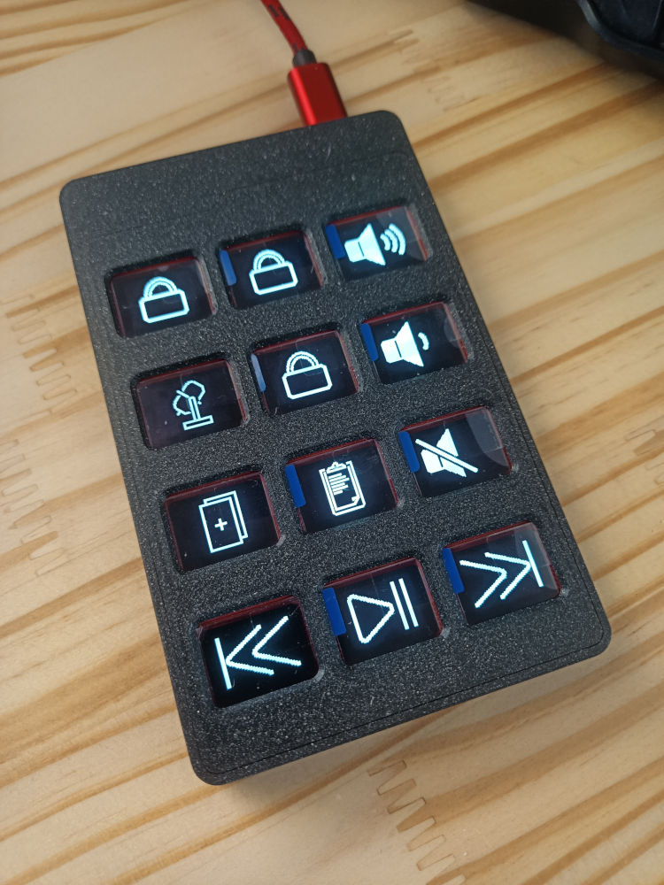
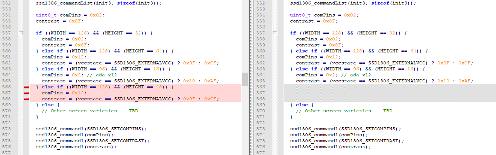
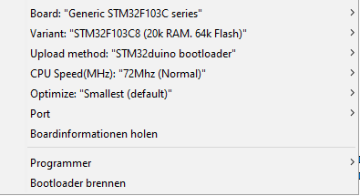

# Keybon - Adaptive Macro Keyboard

Keybon is a macro keyboard with configurable layouts and functions. Integrated into each of its nine tactile buttons is a 0.66” OLED screen. Depending on which app is active on the connected computer, Keybon switches to the suitable key layout thanks to its companion software.

This repository also contains a 12 buttons version called Keybon12. The corresponding files and code were designed by Romain Bazile. It's built upon the work of [CoretechR](https://github.com/CoretechR/Keybon/).




# Instructions

1.  Download the USB bootloader: https://github.com/rogerclarkmelbourne/STM32duino-bootloader

    Connect a USB-to-Serial adapter to the TX/RX pins of your board. Close the BOOT0 jumper before applying power.

    Locate the file to flash, in the folder `bootloader_only_binaries/generic_boot20_pc13.bin`.

    Flash the USB bootloader to the STM32 via the STM32 flasher:  https://www.st.com/en/development-tools/flasher-stm32.html

    You can also use the `stm32loader.py` script provided by `STM32duino-bootloader` team.

    Do not forget to remove the BOOT0 jumper once you're done.

2.  Install the required Arduino libraries listed in the `keybon12.ino` file

    Important: **Adafruit_GFX_Library version 1.7.5** must be installed (dependencies for newer versions are incompatible with the STM32)

    Add these lines to the file `Adafruit_SSD1306.c` (in `Arduino/libraries/Adafruit_SSD1306`)
    
    ```C++
    } else if ((WIDTH == 128) && (HEIGHT == 48)) {
    comPins = 0x12;
	  contrast = (vccstate == SSD1306_EXTERNALVCC) ? 0x9F : 0xCF;
    ```

    They should be added around line 563, right after this:
    ```C++
    } else if ((WIDTH == 96) && (HEIGHT == 16)) {
    comPins = 0x2; // ada x12
    contrast = (vccstate == SSD1306_EXTERNALVCC) ? 0x10 : 0xAF;
    ```

3.  Install STM32 support for the Arduino IDE: https://github.com/rogerclarkmelbourne/Arduino_STM32

    Install the corresponding drivers: https://github.com/rogerclarkmelbourne/Arduino_STM32/tree/master/drivers

4.  Compile and upload the Arduino sketch:

    

    The first time you do this, you will need to short the BOOT1 jumper and then restart your Keybon (either by plugging it in, or by clicking on the reset button).

    If you are using Linux, you may need to add a udev rule to your system (or to use `sudo` with the last command executed by the Arduino IDE).

    If you need to create new icons for your display, you can use the tool at https://javl.github.io/image2cpp/ with png images, in black and white only and a resolution of 64*48 pixels.
